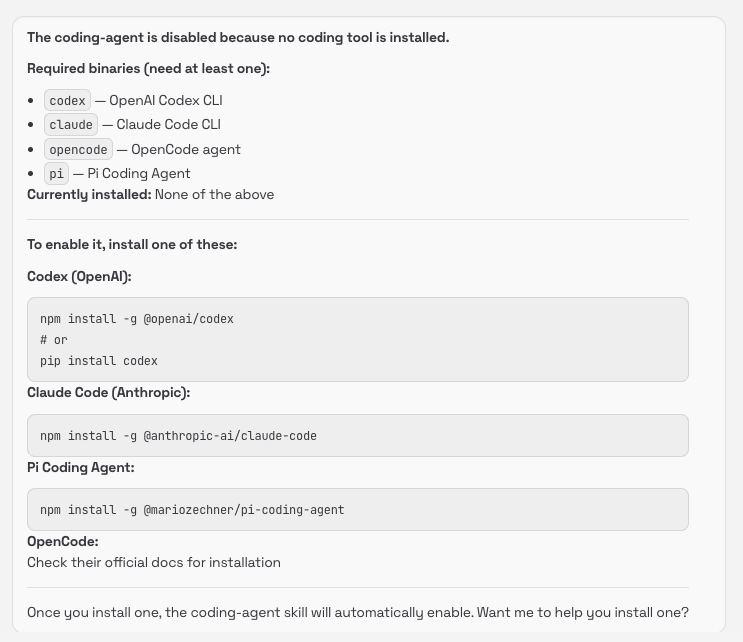
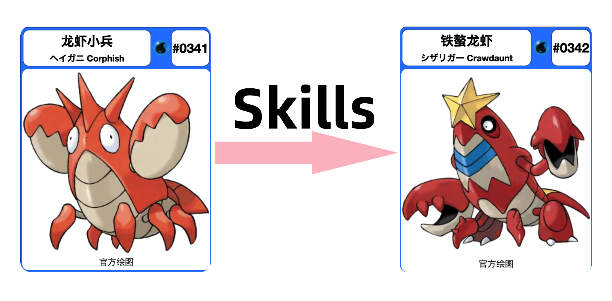

# OpenClaw: The Future of Personal AI Agents

**A Deep Dive for IT Management & Operations Teams**


*Presented by: Matthew Liu*
*February 2026*

---

## Before We Begin: Two Critical Questions

1. **Why You Need to Know OpenClaw**
2. **Why You Should Be Very Careful**

---

## A. Why You Need to Know OpenClaw

| What's Happening | Why It Matters |
|--------|--------|
| **People are asking about it** | 150K+ GitHub stars; your team has seen it on HN, Reddit, X, TikTok |
| **Users may have already deployed it** | Runs on WSL (Windows), Mac, or any Linux box — no IT approval needed |
| **It's not just another chatbot** | Autonomous agents that read files, run commands, and act 24/7 |
| **It touches security & compliance** | Full system access, API keys on server, data handling concerns |
| **Major vendors are following this pattern** | Anthropic's Claude Cowork was inspired by OpenClaw |

> "If you don't understand it, you can't govern it."

---

## B. Why You Should Be Very Careful

| Risk | Severity | Description |
|------|----------|-------------|
| **Full system access** | Critical | Reads/writes files, executes shell commands |
| **API key exposure** | Critical | Keys stored on server, potential leakage |
| **Prompt injection** | High | Malicious inputs can hijack agent behavior |
| **24/7 autonomous operation** | High | Actions taken without human oversight |
| **Early-stage software** | Medium | Vulnerabilities actively being discovered |

> **Feb 2026**: Critical LFI vulnerability discovered in OpenClaw

---

# What Makes OpenClaw Unique

---

<!-- _class: compact -->


## AI Agent as Digital Employee or Personal Assistant?

> **What both roles share:** Stop <span class="red">**repeating**</span> yourself · <span class="red">**Get things done**</span>, not just chat · <span class="red">**Always-on**</span> in your existing apps · Clear <span class="red">**trust & control**</span> boundaries

<div class="cols">
<div class="col">

### Where the "Digital Employee" Differs

**Work offloading**
Reduces cognitive load on repetitive tasks — email triage, workflow chores, routine admin

**Accountability**
Reliable, consistent follow-through you can depend on — like a coworker, not a toy

**Deep integration**
Connects into your work systems and processes — the "employee" earns its title

</div>
<div class="col">

### Where the "Personal Assistant" Differs

**Life admin hub**
Personal logistics via the chat apps you already live in — one interface, not another app

**Proactive nudges**
Scheduled reminders and background checks so you don't have to remember to ask

**Multimodal convenience**
Voice, visuals, and richer UI when typing is annoying or text falls short

</div>
</div>

> *Same engine — continuity, outcomes, access, control. Different job description.*

---

<!-- _class: compact -->


## Why OpenClaw Became Popular — It Addresses Real Needs

<div class="cols" style="align-items: center;">
<div class="col" style="border-right: 2px solid #27ae60; padding-right: 16px;">

#### ✅ Common Needs

**Stop repeating yourself**
— Persistent memory via workspace files

**Get things done**
— Real tool execution — not advice

**Always-on access**
— Self-hosted, cron, heartbeat

**Trust & control**
— Device pairing, approval gates

</div>
<div class="col" style="border-right: 2px solid #2980b9; padding-right: 16px;">

#### ✅ Role-Specific Needs

**"Digital Employee"**
— Work offloading: email, calendar, admin
— Deep integration: MCP, coding agents

**"Personal Assistant"**
— Multi-channel: WhatsApp, Telegram, Discord
— Proactive nudges: cron + heartbeat

</div>
<div class="col">

#### ⚠️ Gaps Remaining

**Accountability**
— No audit trails or SLAs yet

**Multimodal**
— TTS/voice exists, UX maturing

**Non-technical onboarding**
— Setup requires dev skills

**Enterprise compliance**
— No certifications yet

</div>
</div>

> **Plus viral factor:** 180x efficiency claims, open source, community momentum (HN, Reddit, X, TikTok)

---

<!-- _class: compact -->

## OpenClaw vs. The Competition


### How it stacks up on the needs that matter

| Need | OpenClaw | Claude Code | Manus AI |
|------|----------|-------------|----------|
| **Persistent context** | ✅ File-backed memory | ❌ Session only | ⚠️ Cloud-stored |
| **Real tool execution** | ✅ Full filesystem + shell | ✅ Local sandbox | ❌ Cloud only |
| **Always-on access** | ✅ 24/7 self-hosted | ❌ Manual launch | ⚠️ Limited |
| **Trust & control** | ✅ Your server, your rules | ⚠️ Desktop app | ❌ Vendor cloud |
| **Multi-channel** | ✅ WhatsApp, Telegram, Discord, Slack | ❌ None | ❌ Chat only |
| **Proactive nudges** | ✅ Cron + heartbeat | ❌ None | ❌ None |
| **Open source** | ✅ Full transparency | ❌ Proprietary | ❌ Proprietary |
| **Cost model** | API usage only | $100-200/mo | Subscription |

---

## Relationship with Claude Code

```
┌──────────────────────────────────────────────────────────┐
│                     OpenClaw Gateway                     │
│  ┌────────────────────────────────────────────────────┐  │
│  │                   Coding Agent Skill               │  │
│  │  ┌──────────┐ ┌──────────┐ ┌──────────┐ ┌────────┐ │  │
│  │  │  Codex   │ │  Claude  │ │ OpenCode │ │   Pi   │ │  │
│  │  │ (OpenAI) │ │   Code   │ │          │ │        │ │  │
│  │  └──────────┘ └──────────┘ └──────────┘ └────────┘ │  │
│  └────────────────────────────────────────────────────┘  │
└──────────────────────────────────────────────────────────┘
```

OpenClaw can **orchestrate** Claude Code as one of its coding tools:
- Code generation, review, debugging, refactoring
- Uses `claude` CLI as a background process
- Choice of AI coding tools per task

---

# Meet the Creator

---

## Peter Steinberger


- **Austrian Software Engineer**
- Founder of **PSPDFKit** (PDF SDK used by millions)
- Serial open-source contributor
- Built OpenClaw in late 2025

### Philosophy
> "A personal AI assistant that feels less like a chatbot and more like a true digital employee."

**Find him on X**: @steipete

---

# The Evolution Story

---

## From Clawdbot to Moltbot to OpenClaw

<div class="cols">
<div class="col col-left">

```
┌─────────────┐    ┌─────────────┐    ┌─────────────┐
│  Clawdbot   │ →  │   Moltbot   │ →  │  OpenClaw   │
│  (Claude +  │    │  (Molting   │    │  (Open +    │
│   Bot)      │    │   Lobster)  │    │   Claw)     │
└─────────────┘    └─────────────┘    └─────────────┘
   Late 2025         Jan 2026          Jan 30, 2026
   Launch            Trademark         Final Brand
                     Rename
```

### The Name Changes

| Date | Name | Reason |
|------|------|--------|
| Nov 2025 | **Clawdbot** | "Claude" + "Bot" - Initial launch |
| Jan 2026 | **Moltbot** | Anthropic sent polite trademark request |
| Jan 30, 2026 | **OpenClaw** | Final rebrand after trademark search |

</div>
<div class="col col-right">


</div>
</div>


---

## The Chaotic Rebrand Day

<div class="cols cols-70-30">
<div class="col col-left">

Peter's words on the Moltbot → OpenClaw rebrand:

> "Everything that could have gone wrong today went wrong"

- X account briefly hijacked by crypto sellers
- Community confusion across three names
- Documentation scattered

But the project grew despite this:
- **40,000+ GitHub stars** in under 3 months
- Described as "one of the fastest-growing repos ever"

</div>
<div class="col col-right side-note">

**“Space Lobster” mascot**


The lobster represents:
- Molting and evolution
- Capability to take action
- Resilient through rebrands
- Open community spirit

</div>
</div>

---


# A Day with Your AI Assistant

---

<!-- _class: compact -->

## How OpenClaw Fits Your Day

| Time | What the Assistant Does | Category | Role |
|------|------------------------|----------|------|
| 8:00 AM | Morning brief: top AI/tech news to WhatsApp | Stay Informed | PA |
| 9:00 AM | Read & summarize emails, extract action items | Work Smarter | DE |
| 10:00 AM | Research a topic, compare options, recommend | Think Deeper | Both |
| 2:00 PM | Write code, review PRs, debug issues | Build & Ship | DE |
| 3:00 PM | Create content: notes, pages, audio files | Create & Share | Both |
| 5:00 PM | Server config, deployment, file management | Operate & Maintain | DE |
| Anytime | Multi-channel messaging across platforms | Stay Connected | PA |
| 24/7 | Scheduled tasks, monitoring, self-healing | Always On | Both |

---

## 1. Stay Informed: Morning Brief

<!-- _class: compact -->

<div class="cols cols-70-30">
<div class="col col-left">

**RSS feeds → Daily summary → WhatsApp at 8 AM**

- MIT Technology Review, Hacker News, OpenAI Blog
- Synced Review (机器之心 — Chinese AI)
- Top 5 articles, auto-summarized
- Scheduled via cron: every day, 8:00 AM China time

**Also:** X/Twitter monitoring — read tweets, search, bookmarks

*"Good morning! Here are 5 new articles from your feeds..."*

</div>
<div class="col col-right side-note">

**Online case:** Users set up 9 AM Telegram briefings combining calendar + prioritized tasks + news alerts


.png)
</div>
</div>

---


## 2. Work Smarter: Email & Document Processing

<!-- _class: compact -->

**Email from:** Michelin's Security Team
**Subject:** Customer Service AI LLM Security Review

**OpenClaw automatically:**
1. Read the email content
2. Extracted 7 key security questions (data encryption, audit logs, SLA, ISO 42001...)
3. Offered to download & analyze the attached PDF
4. Requested approval before running `curl` and `pdftotext`


**Online case:** Inbox triage at **60x speed** — summarize, prioritize, draft replies

---

## 3. Think Deeper: Research & Recommend

<!-- _class: compact -->

<div class="cols cols-70-30">
<div class="col col-left">

### Camera Recommendation (Chinese)

Asked: *"Recommend RTSP/ONVIF cameras for home"*

**OpenClaw delivered:**
- TP-LINK TL-IPC44AW (¥100-150) — best value
- 360 M1Pro (¥80-120) — PTZ, dual-camera
- Hikvision C1C (¥150-200) — great image quality
- Dahua DH-IPC-HDW1230C (¥120-180) — POE, stable

**Including:** RTSP URL formats, setup steps, purchase advice

</div>
<div class="col col-right side-note">

**Online case:** Personal finance — query hledger via text: *"How much on food last month?"* gets instant answer from thousands of transactions


</div>
</div>

---

## 4. Build & Ship: Coding Agent

<!-- _class: compact -->

<div class="cols cols-70-30">
<div class="col col-left">

### Orchestrates Multiple Coding Tools

| Tool | Provider |
|------|----------|
| `codex` | OpenAI |
| `claude` | Anthropic (Claude Code) |
| `opencode` | OpenCode agent |
| `pi` | Pi Coding Agent |

**Capabilities:** Code generation, review, debugging, refactoring
**How:** Runs coding CLIs as background processes via the `coding-agent` skill

</div>
<div class="col col-right side-note">

**Online case:** Request movie for Jellyseerr media server: *"Add the new Lanthimos movie"* — searches, finds, submits automatically



</div>
</div>

---

## 5. Create & Share: Content Generation

<!-- _class: compact -->

<div class="cols cols-70-30">
<div class="col col-left">

### Text-to-Speech (Multi-language)
- Chinese TTS: auto-downloaded runtime + 60MB model + phoneme dictionary
- Hamlet's soliloquy in English via Brian voice (eleven_v3)
- Audio delivered as WhatsApp voice messages

### Notion Integration
- Created workspace, pages with embedded YouTube videos
- Content management via Notion API
- OAuth-secured, workspace-scoped access

</div>
<div class="col col-right side-note">

**Online case:** File organization — **30 min → 10 seconds**: auto-classify files, create folders, move to right locations


</div>
</div>

---

## 6. Operate & Maintain: System Admin

<!-- _class: compact -->

<div class="cols cols-70-30">
<div class="col col-left">

### Server Configuration (My Experience)

OpenClaw handled:
- Caddy reverse proxy config & deployment
- File management across directories
- `systemctl restart caddy` with sudo
- Remembered file paths for next time

### Elevated Permissions & Approval
- Every `sudo` command requires explicit approval
- "Allow once / Always allow / Deny" dialog
- Self-configured its own elevated permission settings

</div>
<div class="col col-right side-note">

### GUI Remote Access
- `xeyes` via Xpra
- Remote GUI from chat

 

**Online case:** Proactive directory monitoring — auto-notify on trigger conditions

</div>
</div>

---

## 7. Stay Connected: Multi-Channel Hub

<!-- _class: compact -->

| Channel | What OpenClaw Does |
|---------|-------------------|
|  **WhatsApp** | Daily briefs, voice messages, research replies |
|  **Telegram** | Task management, alerts, daily briefings |
|  **Discord** | Team notifications, server management |
|  **Slack** | Channel updates, workflow triggers |
|  **X/Twitter** | Read, search, monitor timelines |
|  **iMessage** | Mac-based personal messaging |

> All from one agent. One conversation context. Persistent memory across channels.

**Online case:** Linear integration — view weekly tasks, create & update assignments, all via Telegram

---

# Architecture Deep Dive

---

<!-- _class: compact -->

## Architecture Overview

<div class="cols">
<div class="col">

### Key Components

| Component | Purpose |
|-----------|---------|
| **Gateway** | Routes events, sessions, config; hosts Control UI / WebChat / Canvas; cron + webhooks |
| **Channels** | WhatsApp / Telegram / Slack / Discord adapters feeding into Gateway |
| **Agent Runtime (Pi)** | Executes agent loop via RPC; streams tool calls and outputs |
| **Models** | Primary + fallback providers (Anthropic, OpenAI, etc.) |
| **Skills + Plugins** | AgentSkills folders (bundled / managed / workspace); ClawHub registry |
| **Identity & Access** | DM policy (pairing / allowlist / open), group allowlists, command auth gates |

</div>
<div class="col">

### High-Level Architecture

```
WhatsApp / Telegram / Slack / …
              │
              ▼
  ┌─────────────────────┐
  │  Gateway (WS ctrl)  │
  │ sessions · presence │
  │ cron · webhooks     │
  │ Control UI · Canvas │
  └─────────┬───────────┘
            │ RPC
            ▼
  ┌──────────────┐      ┌────────────┐
  │ Agent Runtime│-- >  │   Model    │
  │    (Pi)      │      │ providers  │
  └──────┬───────┘      └────────────┘
         ▼
  Tools / Skills / Plugins
```

</div>
</div>

---

<!-- _class: compact -->

## Capability Surfaces

<div class="cols">
<div class="col">

| Surface | Covers |
|---------|--------|
| **Channels** | WhatsApp, Telegram, Discord, Slack, Signal, iMessage, Teams, WebChat + plugins |
| **Core Tools** | browser, canvas, nodes, cron, exec, apply_patch, web_search/fetch |
| **Skills** | AgentSkills folders (bundled + managed + workspace); env-gated |
| **Media** | Understand: image/audio/video; Create: TTS, image gen |
| **Ecosystem** | ClawHub + plugins; review third-party as code |

</div>
<div class="col">

 **Skill Categories (by domain)**

<div style="font-size: 16px; display: flex; gap: 12px;">
<div>

- **Communication** → chat, email
- **Productivity** → calendar, tasks, notes
- **Knowledge & Search** → RAG, wiki, KB
- **Dev & DevOps** → repos, CI/CD

</div>
<div>

- **Data & Analytics** → BI, metrics
- **IT Ops / Observability** → alerts, logs
- **Media** → TTS, image gen
- **Commerce** → orders, pricing

</div>
</div>

</div>
</div>

---

## Security

<!-- _class: compact -->

<div class="cols cols">
<div class="col col-left">

### Elevated Permissions System

| Setting | Meaning |
|---------|---------|
| `tools.elevated.enabled` | Master switch for elevated execution |
| `tools.elevated.allowFrom.webchat` | Allow webchat to use elevated commands |
| `agents.list[].tools.elevated.*` | Per-agent overrides |

### With Elevated ON:
- `dnf install ...`
- `systemctl restart ...`
- Any `sudo` command

### Without It:
Even `sudo echo "hi"` fails

</div>
<div class="col col-right">

## Security Layers

```
┌─────────────────────────────────────────────────┐
│          Layer 1: Network Access                │
│  Cloudflare Access / Reverse Proxy              │
├─────────────────────────────────────────────────┤
│          Layer 2: Gateway Token                 │
│  ?token=xxx on all requests                     │
├─────────────────────────────────────────────────┤
│          Layer 3: Device Pairing                │
│  Explicit approval per device                   │
├─────────────────────────────────────────────────┤
│          Layer 4: Command Approval              │
│  Allow once / Always allow / Deny               │
├─────────────────────────────────────────────────┤
│          Layer 5: Elevated Permissions          │
│  Separate control for sudo/root access          │
└─────────────────────────────────────────────────┘
```
</div>
</div>


---

# My Setup: AliCloud Light App Server

---

<div class="cols cols-70-30">
<div class="col col-left">

## Deployment Architecture

```
┌────────────────────────────────────────────────────────┐
│                    AliCloud (US Region)                │
│  ┌──────────────────────────────────────────────────┐  │
│  │         Lightweight Application Server           │  │
│  │   ┌──────────────┐  ┌───────────────────┐        │  │
│  │   │   OpenClaw   │  │   Caddy (Proxy)   │        │  │
│  │   │   Gateway    │  │   + HTTPS         │        │  │
│  │   └──────────────┘  └───────────────────┘        │  │
|  |                                                  |  |
│  └──────────────────────────────────────────────────┘  │
└────────────────────────────────────────────────────────┘
```

### My Configuration
<!-- _class: compact -->

- Lightweight Application Server
- Alibaba Cloud Linux 3
- Caddy as reverse proxy with auto-HTTPS
- Agent default model: minimax/MiniMax-M2.1 (coding plan)
- Persistent storage for memory
- Memory Search mode: 
  local hf:ggml-org/embeddinggemma-300M-GGUF

</div>

<div class="col col-right">

## Why AliCloud US Region?

<!-- _class: compact -->

| Factor | Reason |
|--------|--------|
| **Latency** | Closer to Anthropic (and other US) API servers |
| **Cost** | Lightweight server: ~$5-10/month |
| **Availability** | 24/7 uptime for always-on agent |
| **Flexibility** | Full root access for customization |
| **Region** | US for API performance |

</div>
</div>


---

## Security Hardening Checklist

| Item | Status | Description |
|------|--------|-------------|
| Reverse Proxy Configured | ✅ | Gateway bound to localhost only |
| Firewall Ports Hardened | ✅ | Unnecessary ports closed |
| Device Pairing Enabled | ✅ | Explicit approval required |
| Filesystem Permissions | ✅ | Strict permissions for sensitive data |
| OAuth Authentication | ✅ | OAuth for locally hosted pages |
| Local Embedding Model | ✅ | Using local LLM for embeddings |

---

# Security! Security! Security!

---

<!-- _class: compact -->


## Critical Security Risks

<div style="display: flex; align-items: center; justify-content: center; height: 80%;">
<div class="cols">
<div class="col">

####  1. Prompt Injection (HIGH)

**Risk:** Malicious content hijacks agent behavior
**Mitigation:** Input validation · Sandboxing · Human approval

####  2. API Key Exposure (HIGH)

**Risk:** Anthropic API keys stored on server
**Mitigation:** Secrets management · Key rotation · Usage alerts

</div>
<div class="col">

####  3. Local File Inclusion (CRITICAL)

**Risk:** Attackers read arbitrary files (Feb 2026 discovery)
**Mitigation:** Patch immediately · Stay updated · Monitor advisories

####  4. Unauthorized Access (MEDIUM)

**Risk:** Unauthorized users gaining access
**Mitigation:** Gateway token · Device pairing ·  Cloudflare Access

</div>
</div>
</div>

---


## Operational Risks

| Risk | Description | Mitigation |
|------|-------------|------------|
| **Cold Starts** | Cloud deployment delays | Keep-alive configuration |
| **Rate Limits** | API throttling | Caching, request optimization |
| **Cost Overruns** | API usage costs | Budget alerts, monitoring |
| **Data Loss** | Ephemeral storage | R2/persistent backup |
| **LLM Hallucinations** | Incorrect actions | Human review for critical tasks |

---

<!-- _class: compact -->

## Best Practices

<div class="cols">
<div class="col">

### ✅ DO

- Enable device pairing for authentication
- Use persistent storage (R2 backup)
- Set up Cloudflare Access for admin routes
- Monitor API usage and costs
- Keep API keys secure and rotate regularly
- Review command approvals carefully

</div>
<div class="col">

### ❌ DON'T

- Use in production without security review
- Expose gateway without authentication
- Grant unrestricted device access
- Skip input validation
- Store sensitive data without encryption

</div>
</div>

---

# Claude Cowork & The Future

---

## Claude Cowork: Born from OpenClaw Patterns

### Timeline

```
Nov 2025: OpenClaw (Clawdbot) launches
          ↓
Dec 2025: Users adapt Claude Code for non-coding tasks
          ↓
Jan 2026: Anthropic launches Claude Cowork
          "We built it in 10 days, largely using Claude Code"
```

### What Anthropic Learned

1. Users want **autonomous file operations**
2. **Persistent context** is critical
3. Multi-step tasks need **agentic behavior**
4. Security must be **sandboxed**

---

## OpenClaw vs Claude Cowork Today

| Aspect | OpenClaw | Claude Cowork |
|--------|----------|---------------|
| **Target User** | Developers, Power Users | Knowledge Workers |
| **Hosting** | Self-hosted | Desktop (Mac only) |
| **Price** | API costs (~variable) | $100-200/month |
| **Channels** | Multi-platform | Local files only |
| **Skills** | 50+ extensible | Built-in only |
| **24/7 Operation** | Yes | Manual |
| **Open Source** | Yes | No |

---


## The Future of Agentic AI

### 2026 Predictions

1. **Hybrid Deployments** — Enterprise: Claude Cowork for workers; Power users: OpenClaw for automation
2. **Multi-Agent Orchestration** — Agents collaborating via MCP protocol; OpenAgents network integration
3. **Security Maturation** — Enterprise-grade sandboxing; Compliance frameworks for AI agents
4. **Skill Ecosystems** — ClawdHub growth; Enterprise skill libraries

---

## What This Means for IT

### Opportunities

- **Automation**: Reduce manual IT tasks
- **Monitoring**: 24/7 intelligent alerting
- **Support**: AI-assisted troubleshooting
- **Integration**: Connect disparate systems

### Challenges

- **Governance**: How to manage shadow AI agents
- **Security**: New attack surfaces
- **Compliance**: Data handling requirements
- **Skills**: Training teams on agentic AI

---

# Key Takeaways

---

## Summary

### OpenClaw is...

1. **Revolutionary** — First mainstream local-first AI agent
2. **Powerful** — Full system access, multi-channel, persistent
3. **Risky** — Security vulnerabilities, requires careful setup
4. **Influential** — Inspired Anthropic's Claude Cowork
5. **Open** — Community-driven, transparent development

### For IT Leaders

- Understand before governing
- Prepare security policies now
- Consider controlled pilots
- Train teams on agentic AI concepts

---

## Resources

| Resource | URL |
|----------|-----|
| **GitHub** | github.com/openclaw/openclaw |
| **Documentation** | docs.clawd.bot |
| **Skills Registry** | clawdhub.com |
| **Community** | Discord / X (@steipete) |
| **Security Advisories** | github.com/openclaw/openclaw/security |

---

## Q&A

**Questions?**

---

# Thank You

**Contact:**
- Presenter: Matthew Liu
- Date: February 2026


*OpenClaw — Your Personal AI Assistant*

---

# Appendix

---

## Appendix A: Installation Quick Start

```bash
# Clone repository
git clone https://github.com/openclaw/openclaw
cd openclaw

# Install dependencies
npm install

# Configure (edit config files)
cp config/example.yaml config/local.yaml
# Edit local.yaml with your API keys

# Start gateway
npm start

# Access Control UI
open http://localhost:3000
```

---

## Appendix B: Useful Commands

| Command | Description |
|---------|-------------|
| `moltbot gateway restart` | Restart the gateway service |
| `moltbot config set <key> <value>` | Update configuration |
| `moltbot skills list` | List available skills |
| `moltbot skills enable <name>` | Enable a skill |
| `clawdhub install <skill>` | Install skill from registry |

---

## Appendix C: Interesting Online Cases

### Viral Demos

1. **Peter's Original Demo** — "72 Hours That Changed Everything"
2. **Data Engineering Use Case** — Medium article on real-world testing
3. **Security Warning Video** — "Don't Run OpenClaw (Moltbot) Yet"

### Community Contributions

- Portuguese explanation videos
- Chinese deployment guides
- Enterprise integration patterns

---

<!-- _class: compact -->

## Appendix D: Comparison Matrix

| Feature | OpenClaw | Claude Code | Claude Cowork | Manus AI |
|---------|----------|-------------|---------------|----------|
| Self-hosted | ✅ | ❌ | ❌ | ❌ |
| Open Source | ✅ | ❌ | ❌ | ❌ |
| Multi-channel | ✅ | ❌ | ❌ | ❌ |
| 24/7 Autonomous | ✅ | ❌ | ❌ | ✅ |
| Persistent Memory | ✅ | ❌ | ❌ | ✅ |
| File Operations | ✅ | ✅ | ✅ | ❌ |
| Coding Focus | ✅ | ✅ | ❌ | ❌ |
| Enterprise Ready | ⚠️ | ✅ | ✅ | ✅ |
